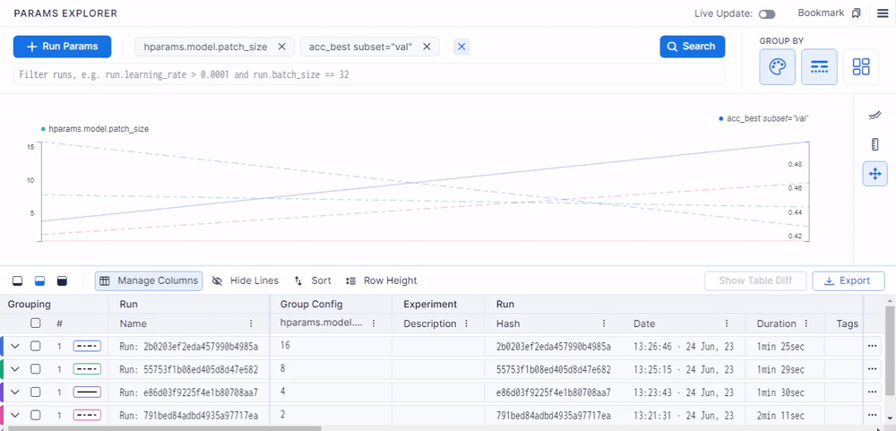
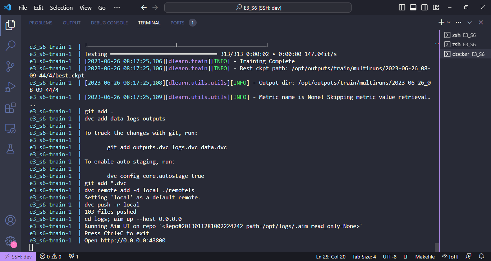

# Session 6

## Introduction

In this session, we run a comparison for the accuracy over different patch sizes for the Vision Transformer. For logging, we use [Aim](https://github.com/aimhubio/aim). The comparison is performed inside Aim's UI.

## Working

A docker compose file has been created. This runs a container that
- creates git and dvc repos.
- sweeps the trainer for different patch sizes
- adds all files to git and dvc
- sets up a remote (local) storage
- pushes logs, datasets, and checkpoints to the storage
- runs aim

All of these commands are executed via a Makefile, which is the CMD for our Docker file.

We can then run `localhost:43800` to view the files.

**Demo**

Also, we can see the files pushed...

